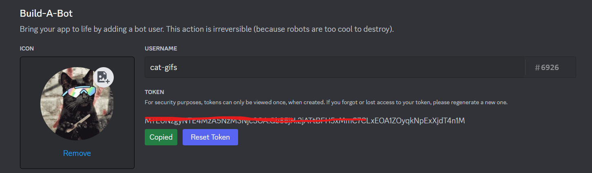

# Discord Cat Gifs Generator 

Cat Gifs Generator is a discord bot that returns an images or gifs related with cats-- depending on users requests. It is the most useless discord bot for pragmatists and brilliant for cat worshippers.

## **Install nextcord module** 🤖
```python
pip3 install nextcord
```
---- or 
```python
pip install nextcord
```

## **Discord token** 🐈⚫
Go to discord developer portal: https://discord.com/developers/docs/getting-started

**Start creating an app**
- Get started and Create app. Customize your application by naming it with your preferences and adding an icon.

**Enable the following controls:**
- Public Bot under Authorization Flow
- Presence Intent
- Message Content Intent

**Saved changes and copy the token:**



## **Cat API** 😺
Go to this link: https://thecatapi.com/

**Get your API Key:**
- Select the button 'GET API KEY' and select your subscription-- Free one will do.

**Fill out your details:**
- Fill out your email address including the additional information. After signing up, the API key will be sent in your email.

Replace the missing token and api in the code and your done. 🐈👌
<br><br>

***PS: This discord bot is not yet completed. Expect new updates and features in the future. -- Please consider contributing :>***