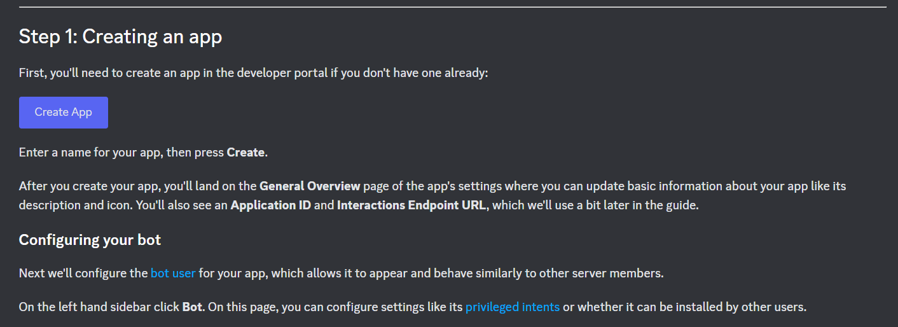
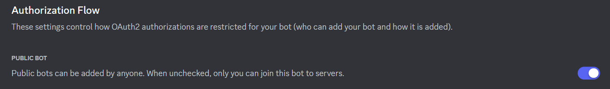
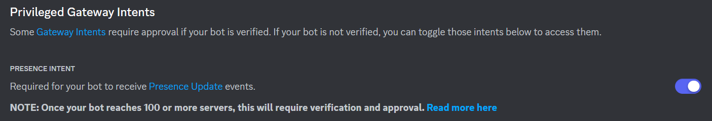
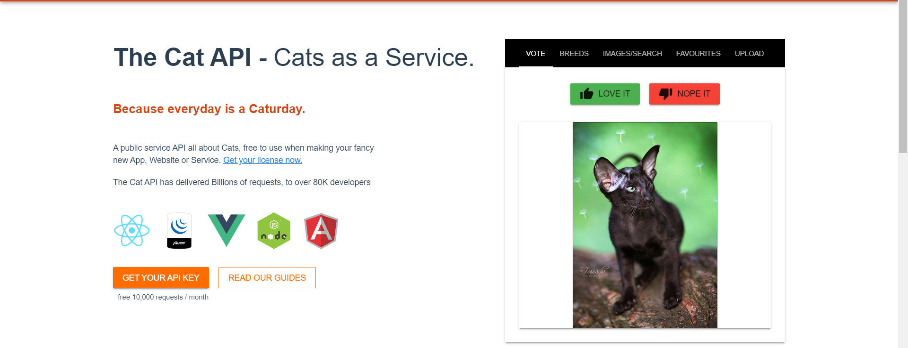
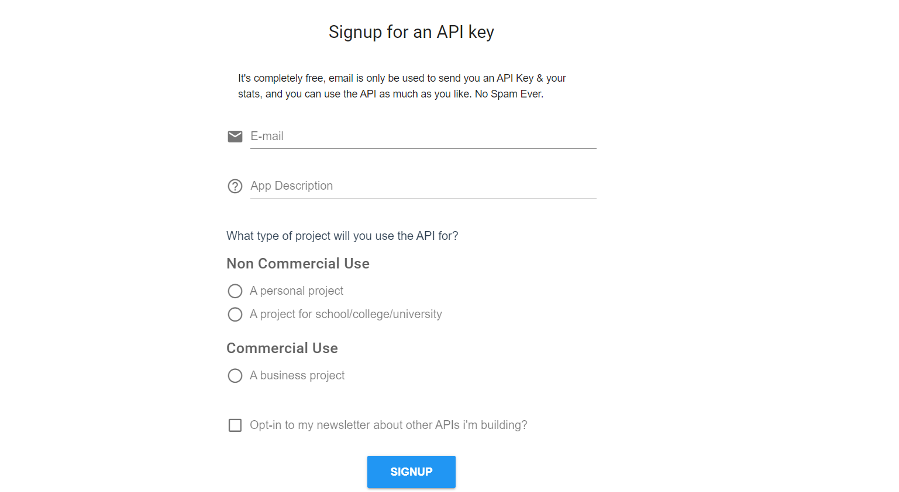
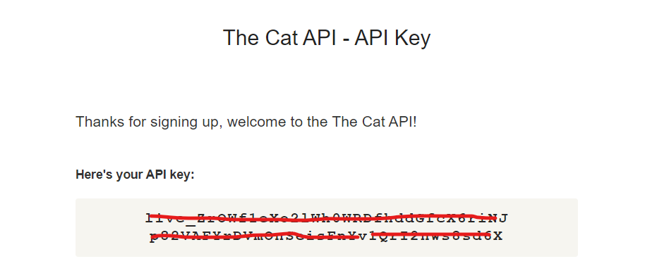

# Discord Cat Gifs Generator 

Cat Gifs Generator is a discord bot that returns an images or gifs related with cats-- depending on users requests. It is the most useless discord bot for pragmatists and brilliant for cat worshippers.

## **Install nextcord module** 🤖
```python
pip3 install nextcord
```

## **Discord token** 🐈⚫
Go to discord developer portal: https://discord.com/developers/docs/getting-started

**Start creating an app**


**Authorize the following controls:**




**Saved changes and copy the token:**


## **Cat API** 😺
Go to this link: https://thecatapi.com/

**Get your API Key:**


**Sign up for free:**


**Fill out your details:**


**There will be an email sent to your address:**


Replace the missing token and api in the code and your done. 🐈👌